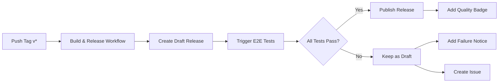

# Quality Gate Process

This document describes the automated quality gate process for releases.

## Overview

All releases go through an automated quality gate that tests the distribution end-to-end before publication. Releases are created as **drafts** and only published if all tests pass.

## Quality Gate Workflow



## Release Process

### 1. Create a Release

```bash
# Create and push a version tag
git tag -a v1.0.0 -m "Release v1.0.0"
git push origin v1.0.0
```

### 2. Automated Build

The `build-and-release.yml` workflow:
- ✅ Builds custom Debian packages
- ✅ Updates APT repository
- ✅ Builds WSL distribution image
- ✅ Creates **draft** release with artifacts

### 3. Quality Gate Testing

The `test-release.yml` workflow automatically runs:

#### Test Suite 1: Release Artifacts (Windows)
- Downloads release artifacts
- Verifies SHA256 checksums
- Imports WSL distribution
- Tests first boot and systemd
- Validates repository configuration
- Installs all tp-* packages:
  - tp-sdkman-java
  - tp-nvm-node
  - tp-docker
- Tests Java 25 compilation and execution
- Tests Node.js 24 execution
- Tests Docker functionality
- Collects performance metrics

#### Test Suite 2: APT Repository (Linux)
- Tests GitHub Pages deployment
- Verifies repository structure
- Tests package installation in Docker
- Validates package metadata

### 4. Quality Gate Decision

#### ✅ If All Tests Pass:
1. Release is **automatically published**
2. Release body updated with:
   - ✅ Quality gate badge
   - Test results summary
   - Link to detailed test report
3. Commit comment posted
4. Release is available for download

#### ❌ If Any Test Fails:
1. Release **remains in draft mode**
2. Release body updated with:
   - ❌ Quality gate failure notice
   - Link to test failures
   - Action items for fixing
3. Issue created with:
   - Failure details
   - Action checklist
   - Links to logs
4. Release should be **deleted** after fixing issues

## Quality Gate Checks

### Mandatory Checks

| Check | Description | Timeout |
|-------|-------------|---------|
| **Checksum Verification** | SHA256 validation of release artifacts | 1 min |
| **WSL Import** | Distribution imports successfully | 2 min |
| **System Boot** | First boot with systemd | 2 min |
| **Repository Config** | APT repositories configured | 1 min |
| **Package Availability** | All tp-* packages available | 2 min |
| **tp-sdkman-java** | Java 25 installs and works | 15 min |
| **tp-nvm-node** | Node 24 + Angular CLI work | 15 min |
| **tp-docker** | Docker CE installs and runs | 10 min |
| **Java Compilation** | Can compile and run Java code | 2 min |
| **Node Execution** | Can run Node.js projects | 2 min |
| **Docker Execution** | Can run Docker containers | 5 min |
| **APT Repository** | GitHub Pages accessible | 2 min |
| **Package Metadata** | All packages listed correctly | 1 min |

**Total Test Time:** ~30-40 minutes

## Release States

### 🟡 Draft (Pending Tests)
- Release created but not published
- Artifacts are uploaded and available
- E2E tests are running
- **Not visible to users** browsing releases

### ✅ Published (Quality Gate Passed)
- All automated tests passed
- Release is public and visible
- Safe for production use
- Quality badge included in release notes

### ❌ Failed (Quality Gate Failed)
- One or more tests failed
- Remains as draft
- Issue created for tracking
- Should be deleted after fixes

## Manual Intervention

### Bypass Quality Gate (Not Recommended)

If you need to manually publish a draft release (emergency only):

```bash
# List draft releases
gh release list

# Manually publish (bypasses quality gate)
gh release edit v1.0.0 --draft=false

# ⚠️ WARNING: This bypasses all automated tests!
```

### Trigger Quality Gate Manually

```bash
# Manually trigger E2E tests for a specific release
gh workflow run test-release.yml -f release_tag=v1.0.0
```

### Fix Failed Release

1. **Review test failures:**
   ```bash
   # View workflow run
   gh run list --workflow=test-release.yml
   gh run view <run-id>
   ```

2. **Fix issues in code**

3. **Delete failed release:**
   ```bash
   gh release delete v1.0.0 --yes
   git tag -d v1.0.0
   git push origin :refs/tags/v1.0.0
   ```

4. **Create new release:**
   ```bash
   git tag -a v1.0.1 -m "Release v1.0.1 - Fixed issues from v1.0.0"
   git push origin v1.0.1
   ```

## Quality Gate Notifications

### Success Notifications
- ✅ Release published automatically
- 💬 Commit comment added
- 📧 GitHub release notification sent
- 🔔 Watchers notified

### Failure Notifications
- ❌ Draft release remains unpublished
- 🐛 Issue created with label `quality-gate-failure`
- 📧 Issue notification sent to watchers
- 🔗 Links to test failures included

## Best Practices

### Before Creating a Release

1. ✅ Test locally using `TEST-DRIVE.md`
2. ✅ Ensure all packages build successfully
3. ✅ Run local validation tests
4. ✅ Update version numbers in package control files
5. ✅ Update CHANGELOG or release notes

### During Quality Gate

1. ⏱️ **Wait for tests to complete** (~30-40 minutes)
2. 👀 **Monitor workflow progress** in Actions tab
3. 📊 **Review test reports** when available
4. ⚠️ **Do not manually publish** while tests are running

### After Quality Gate

#### If Passed:
1. ✅ Release is automatically published
2. 📢 Announce release to users
3. 📝 Update documentation if needed
4. 🎉 Celebrate!

#### If Failed:
1. 🔍 Review failure logs immediately
2. 🐛 Fix identified issues
3. 🗑️ Delete failed draft release
4. 🔄 Create new release with fixes
5. ⏰ Wait for new quality gate

## Metrics and Reporting

### Test Reports

After each quality gate run, reports are generated:

1. **E2E Test Report** (`e2e-test-report`)
   - Detailed test results
   - Performance metrics
   - Package versions tested

2. **APT Repository Report** (`apt-repository-report`)
   - Repository accessibility
   - Package availability
   - Metadata validation

Download reports:
```bash
gh run list --workflow=test-release.yml
gh run download <run-id>
```

### Quality Metrics

Track quality gate statistics:
- ✅ Pass rate
- ⏱️ Average test duration
- 🐛 Common failure reasons
- 📊 Package installation times

## Troubleshooting

### Quality Gate Stuck

If quality gate doesn't start:
```bash
# Check if workflow is enabled
gh workflow list

# Enable if disabled
gh workflow enable test-release.yml

# Manually trigger
gh workflow run test-release.yml -f release_tag=v1.0.0
```

### Tests Taking Too Long

- Normal duration: 30-40 minutes
- Package downloads can be slow on first install
- Docker hub rate limits may cause delays
- Check Actions logs for stuck steps

### False Failures

If tests fail due to transient issues:
1. Check GitHub Actions status
2. Check GitHub Pages deployment status
3. Retry by deleting and recreating release
4. Review specific test logs

## Quality Gate Configuration

### Adjust Timeouts

Edit `.github/workflows/test-release.yml`:

```yaml
- name: Test - Install tp-sdkman-java
  timeout-minutes: 15  # Increase if needed
```

### Add New Tests

Add new test steps to the workflow:

```yaml
- name: Test - Your New Check
  shell: pwsh
  run: |
    # Your test commands
```

### Disable Quality Gate (Not Recommended)

To disable automatic quality gate:

1. Edit `.github/workflows/build-and-release.yml`
2. Change `draft: true` to `draft: false`
3. Remove quality gate workflow trigger

⚠️ **Warning:** This bypasses all automated testing!

## Support

### Common Issues

| Issue | Solution |
|-------|----------|
| Checksum mismatch | Artifacts corrupted, rebuild |
| WSL import fails | Check Windows WSL version |
| Package not found | Wait for GitHub Pages to deploy |
| Docker fails | Check Docker service in WSL |
| Timeout exceeded | Increase timeout in workflow |

### Getting Help

- 📖 Review workflow logs
- 🐛 Check open issues with `quality-gate-failure` label
- 💬 Discuss in repository discussions
- 📧 Contact maintainers

## References

- [GitHub Actions Documentation](https://docs.github.com/en/actions)
- [TEST-DRIVE.md](./TEST-DRIVE.md) - Local testing guide
- [PUBLISHING.md](./PUBLISHING.md) - Publishing process
- [WSL Documentation](https://docs.microsoft.com/en-us/windows/wsl/)
